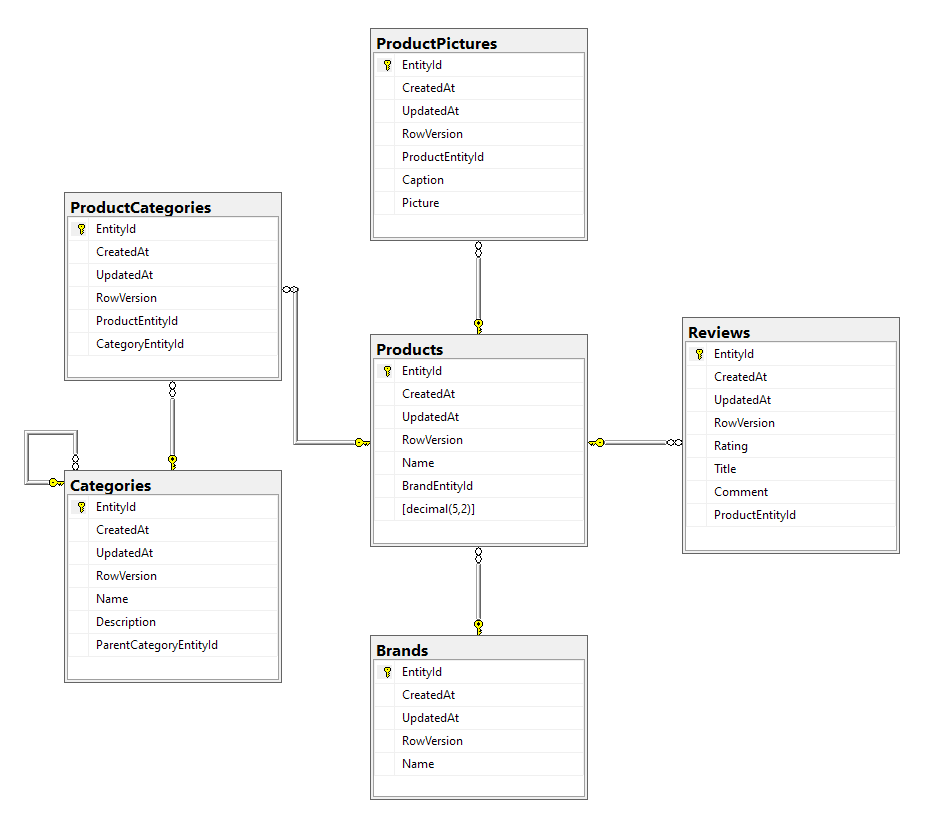

# The Web Shop

Velkommen til _The Web Shop_ dokumentationen.

Her er en liste over diverse områder i codebasen som du kan læse om.

## ER Diagram

## Dependencies

Her er en liste over selve dependency strukturen.

### Nugets

Her er en liste over nuget dependency strukturen.

- `TheWebShop.Common`
  - [`AutoMapper`](https://automapper.org) - 10.0.0
  -
- `TheWebShop.ConsoleApp`
  - [`AutoMapper.Extensions.Microsoft.DependencyInjection`](https://automapper.org) - 8.0.1
  - [`BetterConsoleTables`](https://github.com/douglasg14b/BetterConsoleTables) - 1.1.2
  - [`Microsoft.Extensions.Caching.Redis`](https://asp.net) - 2.2.0
  - [`Microsoft.Extensions.DependencyInjection`](https://asp.net) - 3.1.8
- `TheWebShop.Data`
  - [`Microsoft.EntityFrameworkCore`](https://docs.microsoft.com/en-us/ef/core/) - 3.1.8
  - [`Microsoft.EntityFrameworkCore.Design`](https://docs.microsoft.com/en-us/ef/core/) - 3.1.8
  - [`Microsoft.EntityFrameworkCore.SqlServer`](https://docs.microsoft.com/en-us/ef/core/) - 3.1.8
  - [`Microsoft.EntityFrameworkCore.Tools`](https://docs.microsoft.com/en-us/ef/core/) - 3.1.8
- `TheWebShop.Services`
  - [`Microsoft.Extensions.Caching.Redis`](https://asp.net) - 2.2.0
  - [`Newtonsoft.Json`](https://www.newtonsoft.com/json) - 12.0.3

### Refferences

Her er en liste over reference strukturen.

- `TheWebShop.Common`
  - `TheWebShop.Data`
- `TheWebShop.ConsoleApp`
  - `TheWebShop.Data`
  - `TheWebShop.Services`
- `TheWebShop.Data`
- `TheWebShop.Services`
  - `TheWebShop.Common`
  - `TheWebShop.Data`
